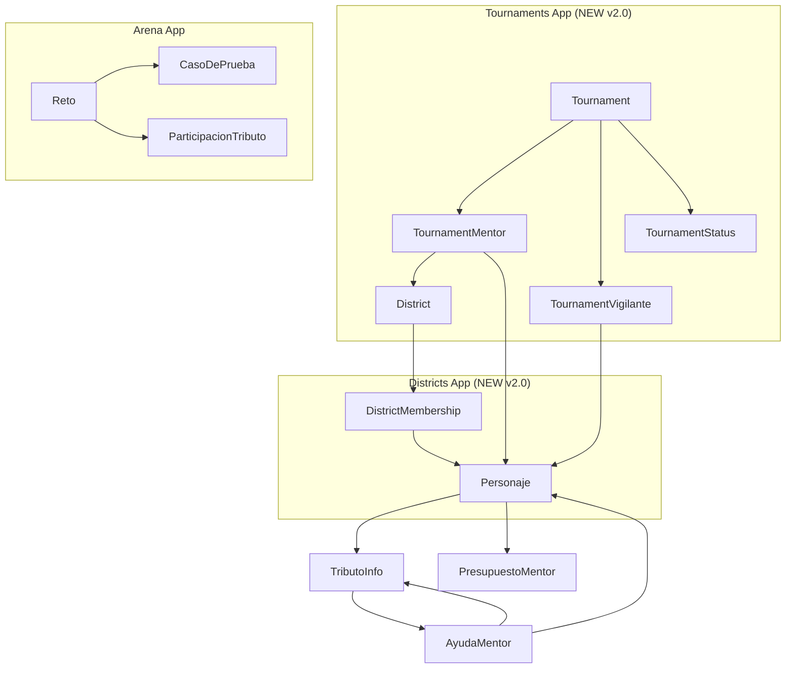

# UNPA Coding Games 🎮

[](https://djangoproject.com/)
[](https://python.org/)
[](https://opensource.org/licenses/MIT)
[]()

Sistema de competencia de programación inspirado en Los Juegos del Hambre para la Universidad Nacional de la Patagonia Austral (UNPA).

> *En el Capitolio, el código es ley. En la arena, solo sobreviven los mejores programadores.* 🔥

## 🆕 Novedades v2.0 (Diciembre 2025)

- 🏆 **Gestión Avanzada de Torneos**: Períodos configurables (acreditación, competencia, premios)
- 🏢 **Sistema de Distritos**: Gestión completa de unidades académicas
- 👥 **Asignación de Mentores por Torneo**: Mentores asignados a distritos específicos
- 👁️ **Roles de Vigilantes**: General, acreditación, competencia, premios
- 📝 **Auditoría de Estados**: Registro completo de cambios en torneos
- ✅ **9 Tests Automatizados**: Suite de pruebas para tournaments app

## 📋 Tabla de Contenidos

- [Descripción](#descripción)
- [Características Principales](#características-principales)
- [Arquitectura](#arquitectura)
- [Tecnologías](#tecnologías)
- [Instalación](#instalación)
- [Configuración](#configuración)
- [Uso](#uso)
- [Roles del Sistema](#roles-del-sistema)
- [API](#api)
- [Desarrollo](#desarrollo)
- [Despliegue](#despliegue)
- [Testing](#testing)
- [Contribuir](#contribuir)
- [Licencia](#licencia)
- [Contacto](#contacto)

## Descripción

Plataforma web completa que simula un sistema de competencias de programación con temática de "Los Juegos del Hambre". Los estudiantes (tributos) compiten en torneos organizados por distritos, guiados por mentores y supervisados por vigilantes, bajo la administración del Jefe del Capitolio.

### 🎯 Objetivos

- Fomentar la práctica de algoritmos y estructuras de datos
- Crear un ambiente competitivo educativo
- Desarrollar habilidades de resolución de problemas
- Integrar tecnologías modernas en la educación

## Características Principales

### 🏆 Sistema de Competencias
- **Torneos Multi-nivel**: Competencias con diferentes dificultades
- **Validación Automática**: Ejecución segura de código con casos de prueba
- **Puntuación Dinámica**: Sistema de puntos basado en eficiencia y complejidad
- **Rankings en Tiempo Real**: Clasificaciones por distrito y global

### 🏆 Gestión Avanzada de Torneos (NEW v2.0)
- **Períodos Configurables**: Acreditación, competencia y premios con fechas flexibles
- **Eventos de Un Día**: Soporte para torneos donde todo ocurre el mismo día
- **Estados de Torneo**: Planificación → Acreditación → Competencia → Premios → Finalizado
- **Auditoría Completa**: Registro de todos los cambios de estado
- **Asignación Masiva**: Asignar múltiples mentores/vigilantes de una vez

### 🏢 Sistema de Distritos (NEW v2.0)
- **Distritos = Unidades Académicas**: Representación clara de la estructura organizacional
- **Colores Personalizables**: Identidad visual por distrito
- **Membresía Flexible**: Usuarios pueden pertenecer a distritos
- **Reutilización**: Los mismos distritos se usan en múltiples torneos

### 👥 Gestión Jerárquica de Roles
- **4 Roles Distintos**: Tributo, Mentor, Vigilante, Jefe del Capitolio
- **Asignaciones Dinámicas**: Mentores por distrito/torneo, Vigilantes con roles específicos
- **Permisos Granulares**: Control de acceso basado en roles

### 🎫 Sistema de Acreditación
- **Credenciales QR Únicas**: Generación automática de códigos QR
- **Acreditación Web**: Escaneo QR mediante webcam del navegador
- **Envío Automático**: Credenciales PDF enviadas por email
- **Estados de Tributo**: Seguimiento completo del proceso de acreditación

### 💰 Sistema de Patrocinio
- **Presupuesto de Puntos**: 1000 puntos iniciales por mentor
- **Ayudas Diferenciadas**: 5 tipos de ayuda con costos variables
- **Límites Diarios**: Máximo 10 ayudas por día
- **Notificaciones en Tiempo Real**: Alertas cuando llegan ayudas

### 📊 Dashboards Personalizados
- **Interfaz Adaptativa**: Diseño específico para cada rol
- **Estadísticas en Vivo**: Métricas actualizadas automáticamente
- **Panel de Monitoreo**: Vigilancia en tiempo real de competencias
- **Gestión de Asignaciones**: Interfaces para asignar mentores y vigilantes

### 🔔 Notificaciones Avanzadas
- **Polling Inteligente**: Actualización cada 30 segundos
- **Toast Notifications**: Alertas no intrusivas
- **Badges de Estado**: Contadores visuales
- **Sonido Opcional**: Notificaciones auditivas

### 🔒 Seguridad y Rendimiento
- **Ejecución Aislada**: Código ejecutado en subprocess seguros
- **Middleware de Acceso**: Control automático de permisos
- **Validación de Input**: Sanitización completa de datos
- **Logs de Auditoría**: Registro de operaciones críticas

## Arquitectura

### 🏗️ Arquitectura General

```
┌─────────────────┐    ┌─────────────────┐    ┌─────────────────┐
│   Frontend      │    │   Backend       │    │   Database      │
│   (Templates +  │◄──►│   (Django)      │◄──►│   (SQLite/PostgreSQL)
│    JavaScript)  │    │                 │    │                 │
└─────────────────┘    └─────────────────┘    └─────────────────┘
         │                       │                       │
         ▼                       ▼                       ▼
┌─────────────────┐    ┌─────────────────┐    ┌─────────────────┐
│   Templates     │    │   Models        │    │   Migrations    │
│   (HTML/CSS/JS) │    │   (Python)      │    │   (SQL)         │
└─────────────────┘    └─────────────────┘    └─────────────────┘
```

### 📁 Estructura del Proyecto

```
UNPA_Coding_Games/
├── 📂 capitol/                    # 👤 Autenticación y gestión de usuarios
│   ├── models.py                 # Personaje, TributoInfo
│   ├── views.py                  # Login, registro, acreditación QR
│   ├── middleware.py             # AccreditationMiddleware
│   ├── utils.py                  # Generación de credenciales PDF
│   ├── templates/capitol/        # Login, registro, acreditación
│   └── static/capitol/           # CSS, JS, imágenes
├── 📂 arena/                      # 🏆 Gestión de retos y participación
│   ├── models.py                 # Reto, Participacion, AyudaMentor, PresupuestoMentor
│   ├── views.py                  # Arena, resolución de retos
│   ├── patrocinio.py             # Lógica de sistema de ayudas
│   ├── templates/arena/          # Arena, editor de código
│   └── static/arena/             # CSS específico de arena
├── 📂 districts/                  # 🏢 Gestión de distritos (NEW v2.0)
│   ├── models.py                 # District, DistrictMembership
│   ├── views.py                  # CRUD de distritos
│   ├── admin.py                  # Admin personalizado
│   └── migrations/               # Migraciones de BD
├── 📂 tournaments/                # 🏆 Gestión avanzada de torneos (NEW v2.0)
│   ├── models.py                 # Tournament, TournamentMentor, TournamentVigilante, TournamentStatus
│   ├── views.py                  # CRUD torneos, asignaciones masivas
│   ├── forms.py                  # Formularios y FormSets
│   ├── admin.py                  # Admin con inlines
│   ├── tests.py                  # 9 tests automatizados
│   ├── templates/tournaments/    # 12 templates especializados
│   └── migrations/               # Migraciones de BD
├── 📂 judge/                      # ⚖️ Sistema de juez automático
│   ├── models.py                 # Submission, TestCaseResult
│   ├── runner.py                 # Ejecutor de código
│   ├── docker_executor.py        # Ejecución segura en Docker
│   └── templates/judge/          # Resultados de ejecución
├── 📂 dashboards/                 # 📊 Dashboards por rol
│   ├── views.py                  # Dashboards y APIs REST
│   ├── forms.py                  # Asignaciones, envío de ayudas
│   ├── templates/dashboards/     # 6 templates especializados
│   └── static/dashboards/js/     # notifications.js
├── 📂 centro_control/             # 👁️ Centro de control
│   └── templates/centro_control/ # Acreditación QR
├── 📂 unpa_code_games/            # ⚙️ Configuración del proyecto
│   ├── settings.py               # Configuración Django
│   ├── urls.py                   # URLs principales
│   └── wsgi.py                   # WSGI para despliegue
├── 📂 docs/                       # 📚 Documentación técnica
│   ├── TOURNAMENTS_ARQUITECTURA_FINAL.md
│   ├── TOURNAMENTS_REFACTOR_DISTRICTS.md
│   ├── JUDGE_SYSTEM.md
│   └── ... (otros docs)
├── 📂 PSI/                        # 📋 Documentación formal (ERS v2.0)
│   └── Especificacion_Requerimientos.md
├── 📄 requirements.txt            # 📦 Dependencias Python
├── 📄 .env.example               # 🔐 Variables de entorno
├── 🐍 manage.py                  # Django CLI
└── 📄 README.md                  # Este archivo
```

### 🗄️ Modelo de Datos Principal



## Tecnologías

### Backend
- **Django 5.0.14** - Framework web MVC
- **Python 3.14+** - Lenguaje de programación
- **SQLite3** - Base de datos (desarrollo)
- **PostgreSQL/MySQL** - Base de datos (producción)

### Frontend
- **HTML5/CSS3** - Estructura y estilos
- **JavaScript ES6+** - Interactividad
- **jsQR** - Lectura de códigos QR en navegador
- **Web Audio API** - Notificaciones sonoras

### Librerías Python
- **python-qrcode + Pillow** - Generación de QR
- **ReportLab** - Creación de PDFs
- **python-decouple** - Gestión de variables de entorno

### Infraestructura
- **Gunicorn** - WSGI HTTP Server
- **Nginx** - Servidor web (producción)
- **Docker** - Contenedorización (opcional)

## Instalación

### Prerrequisitos

- **Python 3.14+**
- **pip** (viene con Python)
- **Git**
- **Virtualenv** (recomendado)

### 🚀 Instalación Rápida

```bash
# 1. Clonar repositorio
git clone https://github.com/NicoButter/UNPA_Coding_Games.git
cd UNPA_Coding_Games

# 2. Crear entorno virtual
python -m venv venv
source venv/bin/activate  # Linux/Mac
# venv\Scripts\activate   # Windows

# 3. Instalar dependencias
pip install -r requirements.txt

# 4. Configurar entorno
cp .env.example .env
# Editar .env con tus valores

# 5. Preparar base de datos
python manage.py migrate

# 6. Crear administrador
python manage.py createsuperuser

# 7. Ejecutar servidor
python manage.py runserver
```

Acceder a **http://127.0.0.1:8000/**

### 📦 Dependencias

```txt
Django==5.0.14
python-decouple==3.8
qrcode[pil]==8.0
Pillow==12.0.0
reportlab==4.4.5
```

## Configuración

### Variables de Entorno (.env)

```env
# Django Core
SECRET_KEY=tu-secret-key-super-segura-aqui
DEBUG=True
ALLOWED_HOSTS=localhost,127.0.0.1,127.0.0.1:8000

# Base de Datos (SQLite por defecto)
DATABASE_URL=sqlite:///db.sqlite3

# Base de Datos PostgreSQL (opcional)
# DB_ENGINE=django.db.backends.postgresql
# DB_NAME=unpa_coding_games
# DB_USER=postgres
# DB_PASSWORD=tu_password_segura
# DB_HOST=localhost
# DB_PORT=5432

# Email Configuration
EMAIL_BACKEND=django.core.mail.backends.smtp.EmailBackend
EMAIL_HOST=smtp.gmail.com
EMAIL_PORT=587
EMAIL_USE_TLS=True
EMAIL_HOST_USER=tu_email@gmail.com
EMAIL_HOST_PASSWORD=tu_app_password
DEFAULT_FROM_EMAIL=UNPA Coding Games <tu_email@gmail.com>

# Security
SECURE_SSL_REDIRECT=False
SESSION_COOKIE_SECURE=False
CSRF_COOKIE_SECURE=False

# Media Files
MEDIA_URL=/media/
MEDIA_ROOT=media/

# Static Files
STATIC_URL=/static/
STATIC_ROOT=staticfiles/
```

### Configuración de Email

Para envío de credenciales PDF:

1. **Gmail**: Generar "App Password" en configuración de seguridad
2. **Outlook/Hotmail**: Usar SMTP de Microsoft
3. **Desarrollo**: Usar `EMAIL_BACKEND=django.core.mail.backends.console.EmailBackend`

## Uso

### 🎮 Flujo Básico del Sistema

1. **Registro de Tributo** → Email con credencial QR
2. **Acreditación** → Escaneo QR por vigilante
3. **Acceso a Arena** → Participación en torneos
4. **Resolución de Retos** → Validación automática
5. **Sistema de Ayudas** → Mentores envían soporte
6. **Monitoreo** → Vigilantes supervisan en tiempo real

### 👑 Roles del Sistema

#### 👤 Tributo (Estudiante)
- ✅ Registrarse y obtener credencial QR
- ✅ Acceder a torneos acreditados
- ✅ Resolver retos de programación
- ✅ Recibir ayudas de mentores
- ✅ Ver rankings y progreso personal

#### 🎓 Mentor (Docente)
- ✅ Gestionar tributos de su unidad académica
- ✅ Enviar ayudas con presupuesto de puntos
- ✅ Ver progreso de sus estudiantes
- ✅ Acceder a estadísticas detalladas

#### 👁️ Vigilante (Staff)
- ✅ Acreditar tributos mediante QR
- ✅ Monitorear competencias en tiempo real
- ✅ Supervisar participación activa
- ✅ Generar reportes de actividad

#### 👑 Jefe del Capitolio (Administrador)
- ✅ Crear y gestionar torneos con períodos configurables
- ✅ Asignar mentores a distritos por torneo
- ✅ Asignar vigilantes con roles específicos (general, acreditación, competencia, premios)
- ✅ Ver distritos sin mentor asignado
- ✅ Asignación masiva de mentores y vigilantes
- ✅ Auditoría completa de cambios de estado
- ✅ Administrar todo el sistema

### 📊 Dashboards por Rol

Cada rol tiene un dashboard personalizado:

- **Tributo**: Torneos disponibles, ayudas pendientes, progreso personal
- **Mentor**: Tributos asignados, presupuesto, estadísticas de ayudas
- **Vigilante**: Panel de acreditación, monitoreo en vivo
- **Jefe**: Asignaciones, estadísticas globales, administración

## API

### Endpoints REST

#### Notificaciones
```
GET /api/notifications/check/
```
- **Descripción**: Obtiene contador de ayudas no leídas
- **Respuesta**: `{"pendientes": 3}`

#### Monitoreo
```
GET /api/monitor/tributos/
```
- **Descripción**: Datos en tiempo real de tributos
- **Respuesta**: Array de objetos con estadísticas

### WebSockets (Futuro)
- Notificaciones en tiempo real
- Actualizaciones de rankings
- Chat entre mentores y tributos

## Desarrollo

### 🧪 Ejecutar Tests

```bash
# Todos los tests
python manage.py test

# Tests específicos por app
python manage.py test capitol.tests
python manage.py test arena.tests
python manage.py test tournaments.tests  # 9 tests (NEW v2.0)

# Con verbose
python manage.py test tournaments -v 2

# Con coverage
coverage run manage.py test
coverage report
```

### 📊 Crear Migraciones

```bash
# Detectar cambios en modelos
python manage.py makemigrations

# Aplicar migraciones
python manage.py migrate

# Mostrar SQL de migración
python manage.py sqlmigrate arena 0001
```

### 🎨 Desarrollo Frontend

```bash
# Colectar archivos estáticos
python manage.py collectstatic

# Modo debug para desarrollo CSS/JS
DEBUG=True en .env
```

### 🔍 Debugging

```bash
# Ver queries ejecutadas
python manage.py shell_plus --print-sql

# Debug toolbar (instalar django-debug-toolbar)
pip install django-debug-toolbar
```

## Despliegue

### 🚀 Producción con Gunicorn + Nginx

```bash
# 1. Configurar variables de producción
DEBUG=False
ALLOWED_HOSTS=tu-dominio.com

# 2. Colectar estáticos
python manage.py collectstatic

# 3. Ejecutar con Gunicorn
gunicorn unpa_code_games.wsgi:application --bind 0.0.0.0:8000

# 4. Configurar Nginx como proxy reverso
```

### 🐳 Docker (Opcional)

```dockerfile
FROM python:3.14-slim

WORKDIR /app
COPY requirements.txt .
RUN pip install -r requirements.txt

COPY . .
RUN python manage.py migrate

EXPOSE 8000
CMD ["python", "manage.py", "runserver", "0.0.0.0:8000"]
```

## Testing

### Estrategia de Testing

- **Unit Tests**: Modelos y lógica de negocio
- **Integration Tests**: Vistas y formularios
- **E2E Tests**: Flujos completos (Selenium opcional)

### Ejecutar Suite de Tests

```bash
# Tests básicos
python manage.py test

# Tests con verbose
python manage.py test --verbosity=2

# Tests paralelos
python manage.py test --parallel

# Coverage
pip install coverage
coverage run manage.py test
coverage html  # Genera reporte HTML
```

## Contribuir

### 🤝 Guía de Contribución

1. **Fork** el proyecto
2. **Crear rama** feature: `git checkout -b feature/nueva-funcionalidad`
3. **Commits** descriptivos: `git commit -m 'feat: agregar validación avanzada'`
4. **Push** a rama: `git push origin feature/nueva-funcionalidad`
5. **Pull Request** con descripción detallada

### 📝 Estándares de Código

- **PEP 8** para Python
- **Black** para formateo automático
- **Flake8** para linting
- **Pre-commit hooks** recomendados

### 🔄 Workflow Git

```bash
# Actualizar main
git checkout main
git pull origin main

# Crear rama feature
git checkout -b feature/nueva-feature

# Desarrollo...
git add .
git commit -m "feat: descripción"

# Push y PR
git push origin feature/nueva-feature
```

## Troubleshooting

### 🔧 Problemas Comunes

#### Error de Migraciones
```bash
# Resetear migraciones
python manage.py migrate --fake-initial
python manage.py migrate
```

#### Email no se envía
- Verificar credenciales SMTP
- Usar `EMAIL_BACKEND=console` para desarrollo
- Revisar logs de servidor

#### QR no se lee
- Verificar permisos de cámara
- Probar en HTTPS (requerido para webcam)
- Verificar librería jsQR cargada

#### Código no ejecuta
- Verificar sintaxis Python
- Revisar límites de tiempo/memoria
- Ver logs de servidor

### 📞 Soporte

- **Issues**: [GitHub Issues](https://github.com/NicoButter/UNPA_Coding_Games/issues)
- **Discussions**: Para preguntas generales
- **Email**: nicobutter@gmail.com

## Licencia

Este proyecto está bajo la **Licencia MIT**. Ver archivo `LICENSE` para más detalles.

```
MIT License

Copyright (c) 2025 Nicolas Butterfield

Permission is hereby granted, free of charge, to any person obtaining a copy
of this software and associated documentation files (the "Software"), to deal
in the Software without restriction, including without limitation the rights
to use, copy, modify, merge, publish, distribute, sublicense, and/or sell
copies of the Software, and to permit persons to whom the Software is
furnished to do so, subject to the following conditions:

The above copyright notice and this permission notice shall be included in all
copies or substantial portions of the Software.
```

## Contacto

**Nicolas Butterfield**  
🎓 **Desarrollador Principal**  
📧 nicobutter@gmail.com  
🔗 [LinkedIn](https://linkedin.com/in/nicolasbutterfield)  
🐙 [GitHub](https://github.com/NicoButter)

**Universidad Nacional de la Patagonia Austral (UNPA)**  
📍 Río Gallegos, Santa Cruz, Argentina  
🌐 [unpa.edu.ar](https://unpa.edu.ar)

---

## 🎯 Roadmap

### ✅ Versión 1.0 (Diciembre 2025)
- Sistema jerárquico completo
- Acreditación QR
- Sistema de patrocinio
- Monitoreo en tiempo real
- Notificaciones avanzadas

### ✅ Versión 2.0 (Diciembre 2025) - ACTUAL
- [x] **App Tournaments**: Gestión avanzada de torneos
- [x] **Períodos Configurables**: Acreditación, competencia, premios
- [x] **App Districts**: Gestión de distritos/unidades académicas
- [x] **Asignación Mentores-Distritos**: Por torneo específico
- [x] **Roles de Vigilantes**: General, acreditación, competencia, premios
- [x] **Auditoría de Estados**: TournamentStatus con historial
- [x] **9 Tests Automatizados**: Suite completa para tournaments
- [x] **Documentación ERS v2.0**: Especificación actualizada

### 🚧 Próximas Features (v3.0)
- [ ] WebSockets para notificaciones en tiempo real
- [ ] Sistema de chat mentor-tributo
- [ ] Análisis de código con IA
- [ ] Torneos en tiempo real con countdown
- [ ] Integración con jueces online (Codeforces, etc.)
- [ ] App móvil complementaria
- [ ] Dashboard de analytics avanzado
- [ ] Sistema de logros y badges

---

*Que los códigos comiencen... y que el mejor programador gane!* 🔥⚡

---

**Desarrollado con ❤️ para la comunidad de programadores de la UNPA**

# Database (PostgreSQL - opcional)
# DB_ENGINE=django.db.backends.postgresql
# DB_NAME=unpa_coding_games
# DB_USER=postgres
# DB_PASSWORD=tu_password
# DB_HOST=localhost
# DB_PORT=5432

# Email (opcional)
EMAIL_BACKEND=django.core.mail.backends.console.EmailBackend
EMAIL_HOST=smtp.gmail.com
EMAIL_PORT=587
EMAIL_USE_TLS=True
EMAIL_HOST_USER=tu_email@example.com
EMAIL_HOST_PASSWORD=tu_password_email
```

## Roles del Sistema

### 👤 Tributo (Estudiante)
- Registrarse en torneos
- Resolver retos de programación
- Ver ranking personal y de distrito
- Obtener credencial QR

### 🎓 Mentor
- Gestionar tributos de su distrito
- Ver progreso de sus estudiantes
- Asignar y revisar retos
- Proporcionar retroalimentación

### 👁️ Vigilante (Staff)
- Acreditar tributos mediante QR
- Monitorear participación
- Supervisar torneos
- Reportes de actividad

### 👑 Jefe del Capitolio (Admin)
- Crear y gestionar torneos
- Asignar mentores a distritos
- Crear retos y casos de prueba
- Administración completa del sistema

## Uso

### Crear un Torneo

1. Ingresar como Jefe del Capitolio
2. Ir a `/admin/arena/torneo/`
3. Completar formulario de torneo
4. Asignar mentores a distritos
5. Activar inscripciones

### Crear un Reto

1. Acceder al panel de administración
2. Crear nuevo Reto en `/admin/arena/reto/`
3. Agregar casos de prueba
4. Configurar validación automática
5. Publicar reto

### Participar en un Reto (Tributo)

1. Ver torneos activos en el dashboard
2. Seleccionar reto disponible
3. Escribir solución en el editor
4. Enviar código
5. Ver resultados de validación

## Desarrollo

### Crear migraciones
```bash
python manage.py makemigrations
python manage.py migrate
```

### Ejecutar tests
```bash
python manage.py test
```

### Colectar archivos estáticos
```bash
python manage.py collectstatic
```

## Contribuir

1. Fork el proyecto
2. Crear rama feature (`git checkout -b feature/NuevaFuncionalidad`)
3. Commit cambios (`git commit -m 'Agregar nueva funcionalidad'`)
4. Push a la rama (`git push origin feature/NuevaFuncionalidad`)
5. Abrir Pull Request

## Licencia

Este proyecto está bajo la Licencia MIT. Ver archivo `LICENSE` para más detalles.

## Contacto

**Nicolas Butterfield**  
📧 nicobutter@gmail.com

**Universidad Nacional de la Patagonia Austral (UNPA)**

Desarrollado para fomentar la práctica de programación entre estudiantes de la UNPA.

---

*Que los juegos comiencen* 🔥
